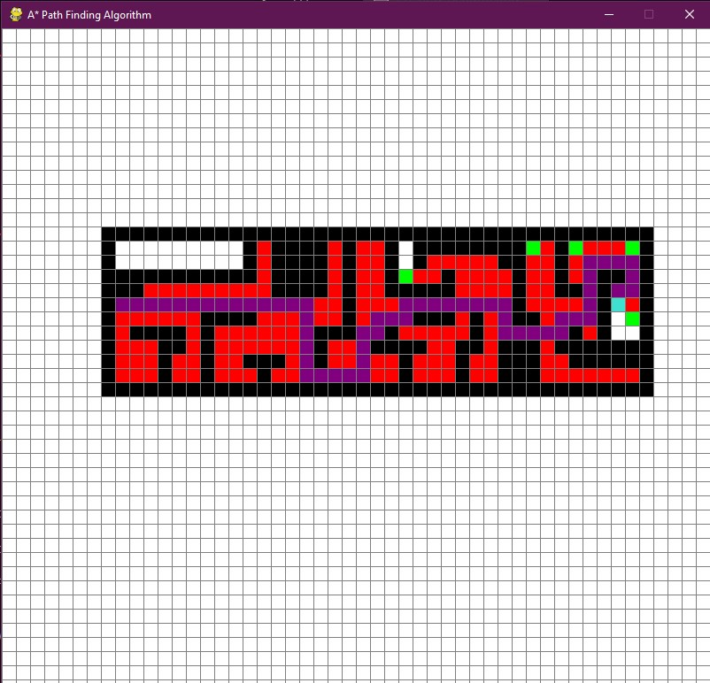

# **A-Star Path Finding Algorithm**

 A* is a graph traversal and path search algorithm, which is often used in many fields of computer science due to its completeness, optimality, and optimal efficiency. This projects helps in visulizung the working of A* Algorithm. It is written using Python, Pygame(Python module).

#  **Algorithm in Action**

